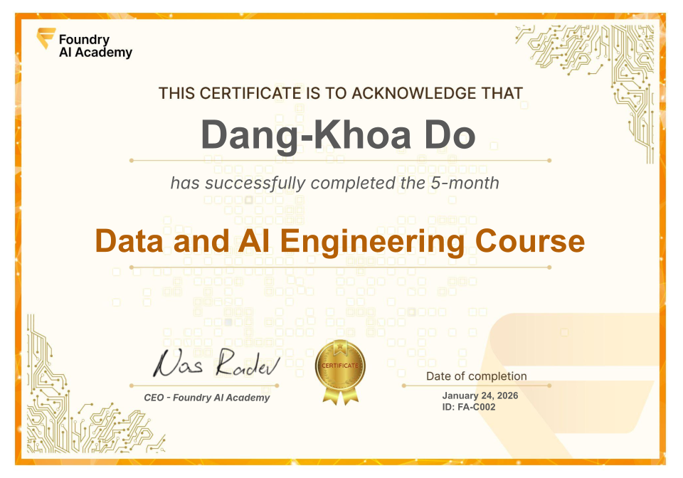

# Certificate of Achievement: Data & AI Engineering Course v2

## Awarded to **Khoa Dang Do**

[Download Certificate (PDF) :fontawesome-solid-download:](trainee-khoa-dang-do-2027-01.pdf){ .md-button .md-button--primary }

### Certificate Details
- **Certificate ID**: `FA-C002`
- **Certificate Holder ID**: `FA-C002/trainee-khoa-dang-do-2027-01`

### Course Information
- **Course**: [Data & AI Engineering Course v2](https://www.foundry.academy/)

### Issued by
[**Foundry AI Academy**](https://www.foundry.academy/)

### Certification Period
- **Issued**: January 2027
- **Valid Until**: No expiration

### Comments
This certifies that Khoa Dang Do has successfully completed the Data & AI Engineering Course v2 from Foundry AI Academy, having met all academic requirements and demonstrated proficiency, diligence, and commitment to advanced study in Data and AI Engineering.

### Demonstrated Areas of Competence
- Data ingestion, transformation, and automated pipeline development
- Cloud data warehousing and data modeling
- Data transformation using `dbt`
- Real-time data streaming and workflow orchestration
- AI agent design with LLMs, tool calling, state & memory management
- Fundamental retrieval-augmented generation (RAG) systems
- End-to-end Data & AI solution delivery through a capstone project

---

For more information about our programs, visit [Foundry AI Academy](https://www.foundry.academy/).
