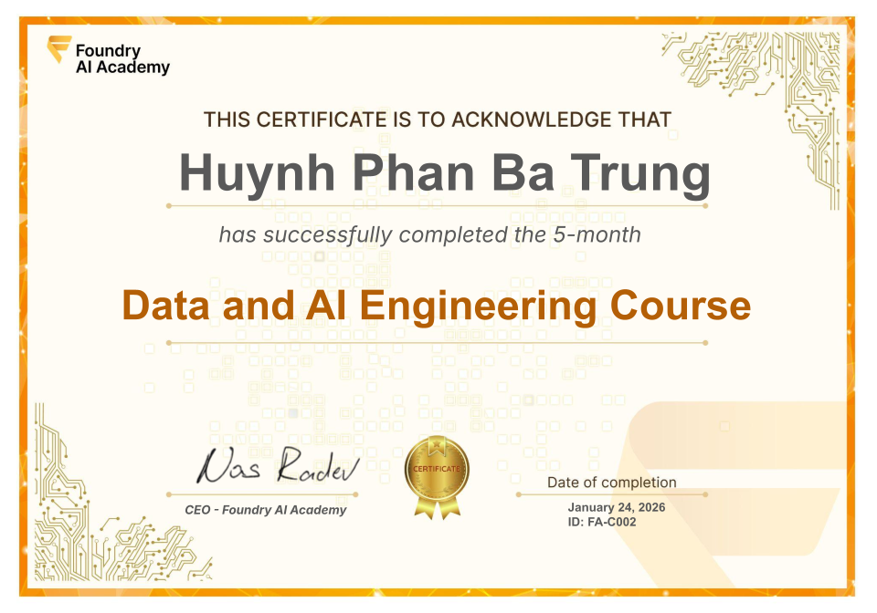

# Certificate of Achievement: Data & AI Engineering Course v2

## Awarded to **Trung Phan Ba Huynh**

### Certificate Details
- **Certificate ID**: `FA-C002`
- **Certificate Holder ID**: `FA-C002/trainee-trung-phan-ba-huynh-2027-01`

### Course Information
- **Course**: [Data & AI Engineering Course v2](https://www.foundry.academy/)

### Issued by
[**Foundry AI Academy**](https://www.foundry.academy/)

### Certification Period
- **Issued**: January 2027
- **Valid Until**: No expiration

### Comments
Trung Phan Ba Huynh has successfully completed the Data & AI Engineering Course v2. We commend their dedication and expertise in the field.

---

For more information about our programs, visit [Foundry AI Academy](https://www.foundry.academy/).
